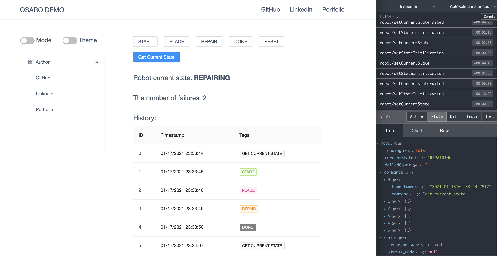

## OSARO Frontend Challenge

> This is my OSARO Frontend Challenge Solution. Created By: Chenxi Cheng | Time: 01/17/2021

### 1. Preview

### 2. How to run project

#### Frontend

- run `cd frontend` to go to the frontend folder
- run `yarn install` to install dependencies
- run `yarn start` to start the frontend project

#### Backend

- run `cd backend` to go to the backend folder
- create a virtual envrionment called `env` within the backend folder `python -m venv ./env`
- activate the virtual environment `source ./env/bin/activate` (MAC command)
- run `pip install flask==0.12.2 enum34==1.1.6 flask_cors` to install dependencies
- run project `python app.py`

### 3. Tech Stack

#### Frontend

- React
- Ant Design UI
- Redux (@reduxjs/toolkit)
- Dayjs

#### Backend

- Flask
- Flask CORS
